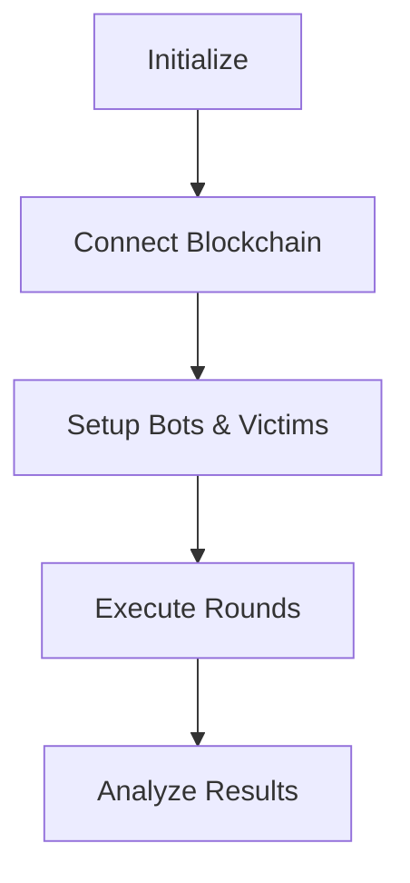

# MEV-Simulator

Professional MEV research platform that simulates attacks using real Uniswap V3 pools on Arc Testnet.

## Features

- **Real Blockchain Environment**: Simulation on actual Uniswap V3 pools on Arc Testnet
- **MEV Bot Strategies**: Aggressive, Conservative, Slow, Adaptive strategies
- **Victim Profiles**: Retail, Whale, DCA Bot, Arbitrage Bot, Panic Seller
- **Latency Modeling**: Network delays and inter-bot competition
- **Data Analysis**: Automated analysis with CSV/JSON export
- **Configurable**: YAML-based configuration system

## Latest Results (Arc Testnet)

```
MEV Profit: 34.02 USDC
Victim Loss: 43.01 USDC  
Success Rate: 81.6%
Victim Trades: 8 executed, 1 failed
MEV Attacks: 76 attempts, 62 successful
```

## Installation

```bash
git clone <repo-url>
cd MEV-simulator

python3 -m venv venv
source venv/bin/activate

pip install -r requirements.txt
```

## Environment Setup

Set your Arc Testnet private key:

```bash
export DEPLOYER_PRIVATE_KEY="your_private_key_here"
```

## Usage

### Quick Test

```bash
python scripts/run_complete_simulation.py --environment arc_testnet --quick-test --confirm
```

### Development Environment

```bash
python scripts/run_complete_simulation.py --environment development --quick-test
```

## Architecture

### Simulation Flow



### Components

**MEV Bots**
- Aggressive: Fast detection, high gas bidding
- Conservative: Cautious approach, consistent profits
- Adaptive: Dynamic strategy adjustment
- Slow: Cost-effective delayed response

**Victim Traders**
- Retail: Small trades, high slippage tolerance
- Whale: Large trades, low slippage tolerance
- DCA Bot: Regular purchasing patterns
- Arbitrage Bot: Fast cross-market trading
- Panic Seller: Emotional high-slippage trades

## Configuration

### Basic Configuration

```yaml
simulation:
  duration_minutes: 10
  target_transactions: 100

mev_bots:
  bot1:
    strategy: "aggressive"
    initial_balance_eth: 1.0
    latency_profile: "fast"

victim_transactions:
  traders:
    retail_alice:
      type: "retail"
      initial_balances:
        PKING: 1000
        PQUEEN: 500
        ETH: 2.0
```

### Network Settings

```yaml
arc_testnet:
  network:
    rpc_url: "https://arc-testnet.stg.blockchain.circle.com"
    chain_id: 1337
    contracts:
      paul_king_token: "0x6911406ae5C9fa9314B4AEc086304c001fb3b656"
      paul_queen_token: "0x3eaE1139A9A19517B0dB5696073d957542886BF8"
      uniswap_pool: "0x39A9Ba5F012aB6D6fc90E563C72bD85949Ca0FF6"
```

## Examples

### Basic Simulation

```bash
python examples/basic_simulation.py
```

### Custom Strategy

```bash
python examples/custom_mev_strategy.py
```

### Research Analysis

```bash
python examples/research_analysis.py
```

### Interactive Tutorial

```bash
python examples/tutorial_walkthrough.py
```

## Result Analysis

### Key Metrics

- **MEV Profit**: Total profit extracted by bots (USDC)
- **Victim Loss**: Total losses incurred by victims (USDC)
- **Success Rate**: Percentage of successful MEV attacks
- **Extraction Efficiency**: Ratio of MEV profit to victim losses
- **Value Destroyed**: Network inefficiency losses

### Example Analysis

```python
import pandas as pd

df = pd.read_csv('data/results/simulation_*/mev_analysis.csv')
print(f"Total MEV Profit: {df['mev_profit'].sum():.6f} USDC")
print(f"Success Rate: {df['success'].mean():.1%}")
```

## Advanced Configuration

### Custom Bot Strategy

```yaml
mev_bots:
  custom_bot:
    strategy: "custom"
    strategy_params:
      bid_percentage: 75.0
      max_slippage: 0.02
      min_profit_threshold: 0.01
```

### Victim Patterns

```yaml
victim_transactions:
  traders:
    custom_victim:
      type: "whale"
      custom_pattern:
        frequency_seconds: 3600.0
        amount_range: [1000, 5000]
        slippage_tolerance: 0.003
```

## Troubleshooting

### Connection Issues

```bash
# Check RPC URL in config/environment.yaml
# Verify network connectivity
```

### Insufficient Balance

```bash
# Ensure deployer account has USDC on Arc Testnet
```

### Import Errors

```bash
# Run from project root directory
# Verify Python path configuration
```

## Documentation

- [`docs/CONFIG_GUIDE.md`](docs/CONFIG_GUIDE.md) - Configuration reference
- [`docs/ARCHITECTURE.md`](docs/ARCHITECTURE.md) - Technical architecture
- [`examples/README.md`](examples/README.md) - Usage examples

## License

MIT License