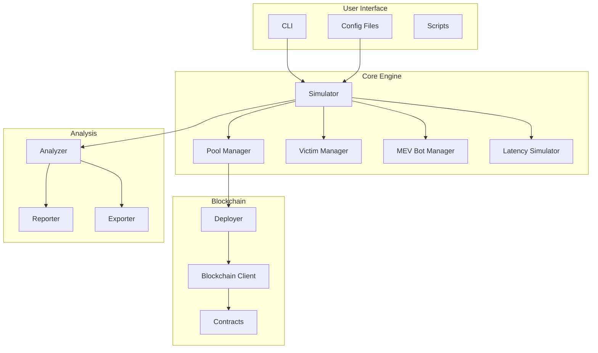
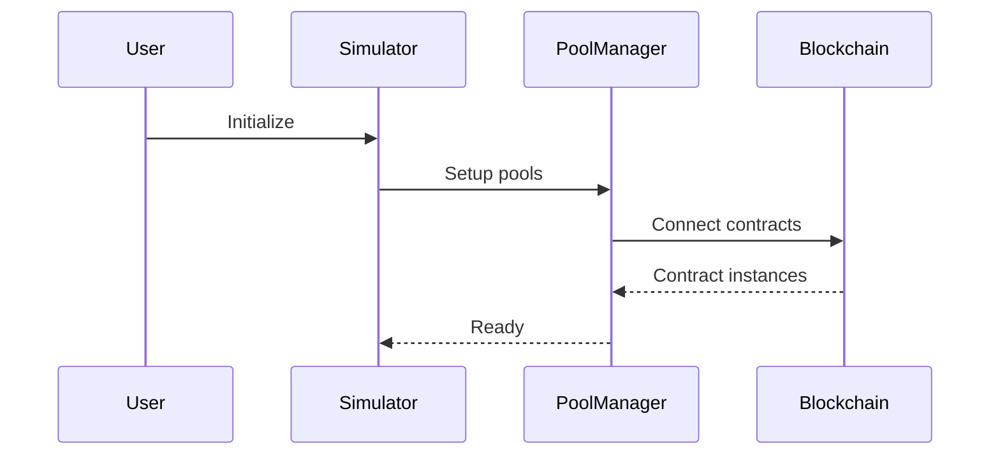
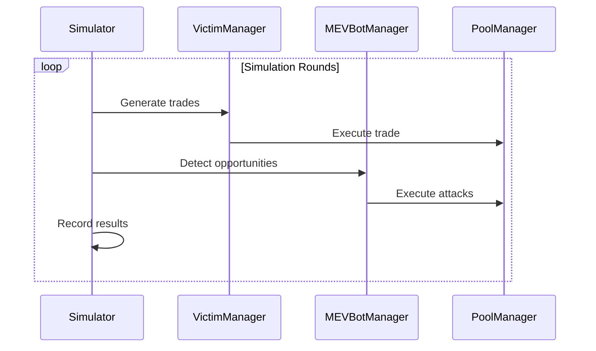
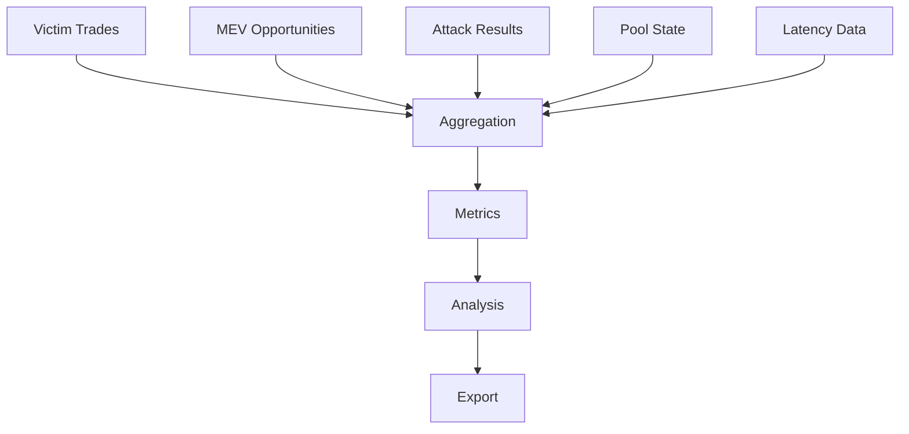
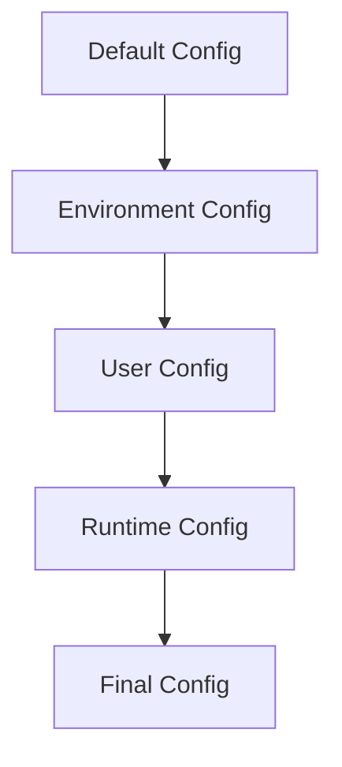
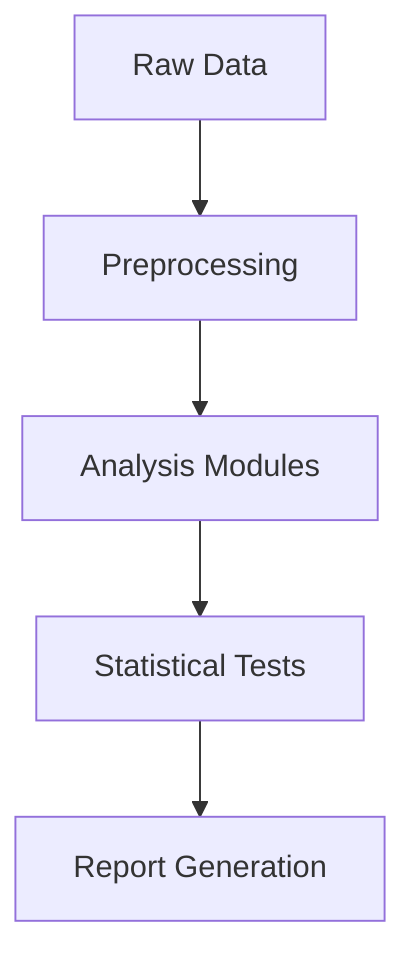

# Architecture Documentation

## System Overview



## Simulation Flow

### Initialization



### Execution Loop



## Core Components

### Simulator (`src/core/simulator.py`)

Central orchestrator managing simulation lifecycle.

```python
class MEVSimulator:
    async def setup_simulation()          # Initialize components
    async def run_simulation()            # Execute rounds
    async def _execute_round()            # Single round execution
    def _compile_results()                # Aggregate results
```

### Pool Manager (`src/core/pool_manager.py`)

Manages Uniswap V3 pool interactions.

```python
@dataclass
class PoolInfo:
    address: str
    token0: TokenInfo
    token1: TokenInfo
    fee: int
    current_tick: int
    sqrt_price_x96: int
    liquidity: int

@dataclass
class SwapResult:
    tx_hash: str
    success: bool
    amount_in: float
    amount_out: float
    slippage: float
    gas_cost: float
```

### MEV Bot System (`src/core/mev_bot.py`)

Bot strategy implementations and competition logic.

```python
class MEVBot:
    strategy_type: BotStrategy
    latency_simulator: LatencySimulator
    current_balance: float
    attack_history: List[AttackResult]
    
    async def detect_mev_opportunity()
    async def execute_sandwich_attack()
    def calculate_bid()
```

**Strategy Types:**
- **Aggressive**: High-speed, maximum profit
- **Conservative**: Risk-averse, consistent profits
- **Adaptive**: Dynamic strategy adjustment
- **Slow**: Cost-effective delayed response

### Victim Trader System (`src/core/victim_trader.py`)

Victim behavior patterns and trade generation.

```python
@dataclass
class TradingPattern:
    frequency_seconds: float
    amount_range: Tuple[float, float]
    slippage_tolerance: float
    gas_sensitivity: float
    patience_level: float
    token_preference: List[str]
```

**Victim Types:**
- **Retail**: Small trades, high slippage tolerance
- **Whale**: Large trades, low slippage tolerance
- **DCA Bot**: Regular consistent purchases
- **Arbitrage Bot**: Fast cross-market trading
- **Panic Seller**: Emotional high-slippage trades

### Latency Simulation (`src/core/latency_simulator.py`)

Network delay and competition modeling.

```python
@dataclass
class LatencyProfile:
    block_detection: int      # Block detection time
    market_update: int        # Market data processing
    calculation: int          # Opportunity calculation
    bundle_creation: int      # Transaction bundle creation
    network_submission: int   # Network submission
    jitter: float            # Random variation
```

## Data Flow

### Data Collection



### Event System

```python
class SimulationEvent:
    NEW_BLOCK = "new_block"
    VICTIM_TRADE = "victim_trade"
    MEV_OPPORTUNITY = "mev_opportunity"
    MEV_ATTACK = "mev_attack"
    POOL_UPDATE = "pool_update"
    ROUND_COMPLETE = "round_complete"
```

## Configuration System

### Configuration Hierarchy



**Precedence Order:**
1. Runtime parameters (highest)
2. Environment variables
3. User configuration files
4. Environment-specific configs
5. Default configuration (lowest)

### Configuration Loading

```python
class ConfigurationManager:
    def load_configuration(self, env: str) -> Dict[str, Any]:
        config = self._load_default_config()
        env_config = self._load_environment_config(env)
        config = deep_merge(config, env_config)
        config = self._apply_env_variables(config)
        self._validate_configuration(config)
        return config
```

## Analysis System

### Analysis Pipeline



### Core Metrics

```python
class MEVMetrics:
    total_mev_profit: float
    total_victim_loss: float
    success_rate: float
    extraction_efficiency: float
    value_destroyed: float
    bot_performance_ranking: List[str]
```

## Performance Architecture

### Optimization Strategies

**Asynchronous Processing:**
```python
async def execute_mev_competition(opportunities):
    tasks = [
        bot.evaluate_opportunity(opp) 
        for bot in self.mev_bots 
        for opp in opportunities
    ]
    results = await asyncio.gather(*tasks)
    return self._determine_winners(results)
```

**Caching:**
```python
@lru_cache(maxsize=128)
def get_contract_instance(address: str, abi: List[Dict]):
    return self.web3.eth.contract(address=address, abi=abi)
```

**Memory Management:**
```python
class BatchProcessor:
    async def process_trades(self, trades: List[Trade]):
        for batch in self._create_batches(trades):
            await self._process_batch(batch)
            gc.collect()
```

## Extension Points

### Custom Strategy Plugin

```python
class CustomMEVStrategy(MEVStrategy):
    async def detect_opportunities(self, market_data):
        # Custom logic
        pass
        
    async def calculate_bid(self, opportunity):
        # Custom bidding
        pass
```

### Custom Analysis Module

```python
class CustomAnalyzer(BaseAnalyzer):
    def analyze(self, simulation_data: SimulationData) -> AnalysisResult:
        return AnalysisResult(
            findings=self._generate_findings(),
            metrics=self._calculate_metrics(),
            visualizations=self._create_charts()
        )
```

## Deployment Architecture

### Contract Deployment

```python
class ContractDeployer:
    async def setup_complete_environment(self, network_config):
        # Connect to existing contracts
        tokens = self._connect_tokens(network_config)
        pools = self._connect_pools(network_config)
        return {'tokens': tokens, 'pools': pools}
```

### Network Integration

Supports multiple environments:
- **Arc Testnet**: Production testing environment
- **Development**: Local Anvil fork for rapid iteration
- **Custom**: User-defined network configurations

## State Management

### Global State

```python
@dataclass
class SimulationState:
    current_round: int
    total_victim_trades: int
    total_mev_attacks: int
    cumulative_mev_profit: float
    cumulative_victim_loss: float
    pool_states: Dict[str, PoolState]
    bot_balances: Dict[str, float]
```

**State Properties:**
- Atomic updates per transaction
- Rollback support for failed transactions
- Consistency validation
- Snapshot capability for analysis